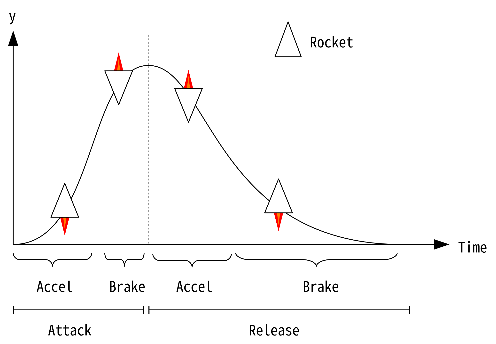

# 放物線エンベロープ
加速度が一定のときに現れる放物線を使ってエンベロープを作ります。次の図は例として加速度が一定のエンジンを積んだロケットをある点から別の点へ移動させて戻ってくるモデルを表しています。



## 加速度を任意に決める方法
アタックの区間での加速度 $a_A$ と $b_A$ 、加速から減速に切り替える時点 $t_A$ をユーザが指定するときに、曲線の最大値となるピーク $h_p$ とその時点 $t_p$ を求めます。


記号の定義です。下付き文字の $A$ はアタックのパラメータを表しています。

- $t$ : 時間
- $y$ : 原点からの距離
- $t_A$ : 加速から減速に切り替える時点
- $a_A$ : 加速時の加速度の絶対値
- $b_A$ : 減速時の加速度の絶対値

時点 $t_A$ での位置 $h_A$ と速度 $v_A$ を知りたいです。まずはアタックの加速中の加速度の式 $\ddot{y_A}(t)$ から速度の式と位置の式を求めます。

$$
\begin{aligned}
\ddot{y_A}(t) &= a_A \\
\dot{y_A}(t) &= \int \ddot{y_A}(t)\,dt = a_A t \\
y_A(t) &= \int \dot{y_A}(t)\,dt = a_A \frac{t^2}{2}
\end{aligned}
$$

速度と位置の式に $t_A$ を代入します。

$$
\begin{aligned}
v_A &= \dot{y_A}(t_A) = a_A t_A \\
h_A &= y_A(t_A) = a_A \dfrac{t_A^2}{2}
\end{aligned}
$$

$v_A$ と $h_A$ はアタックの減速中の式の初期状態になります。

アタックの減速中の加速度の式 $\ddot{y_p}(t)$ から速度と位置の式を求めます。

$$
\begin{aligned}
\ddot{y_p}(\tau_k) &= - b_A \\
\dot{y_p}(\tau_k) &= - b_A \tau_k + v_A \\
y_p(\tau_k) &= - b_A \frac{\tau_k^2}{2} + v_A \tau_k + h_A \\
\tau_k &= t - t_A
\end{aligned}
$$

$\dot{y_p}(t_p) = 0$ となる時点 $t_p$ を求めます。

$$
\begin{aligned}
0 &= - b_A t_p + v_A \\
t_p &= \frac{v_A}{b_A}
\end{aligned}
$$

$y_p(t_p) = h_p$ となります。

$$
\begin{aligned}
h_p
&= y_p(t_p) \\
&= y_p\left( \frac{v_A}{b_A} \right) \\
&= -\frac{b_A}{2} \left( \frac{v_A}{b_A} \right)^2 + v_A \left( \frac{v_A}{b_A} \right) + h_A
\end{aligned}
$$

### 正規化
$h_{p} = 1$ となるような $a_A$ と $b_A$ への係数 $\nu$ を決めます。

$$
\begin{aligned}
h_{p} =
1 &= - \nu b_A \frac{t_p^2}{2} + v_A t_p + h_A \\
v_A &= \nu a_A t_A \\
h_A &= v_A \dfrac{t_A}{2} \\
t_p &= \frac{v_A}{\nu b_A}
\end{aligned}
$$

Maxima で解きます。

```maxima
v_A: ν * a_A * t_A;
h_A: v_A * t_A / 2;
t_p: v_A / (ν * b_A);
solve(1 = - (ν * b_A * t_p^2) / 2 + v_A * t_p + h_A, ν);
```

得られた $\nu$ です。

$$
\nu=\frac{2 {b_A}}{\left( {a_A} {b_A}+{{{a_A}}^{2}}\right)  {{{t_A}}^{2}}}
$$

### 実装
Python3 です。

```python
import numpy
import matplotlib.pyplot as pyplot

class AccelEnvelope:
    """
    timeR はピーク時間 t_p からのオフセット。 例えば t_p = 1 かつ timeR = 0.5 なら
    リリースの加速度の変更はエンベロープの開始から 1.5 秒後となる。
    """
    def __init__(
        self,
        samplerate: float,
        accelA: float,
        brakeA: float,
        timeA: float,
        accelR: float,
        brakeR: float,
        timeR: float,
    ):
        self.counter: int = -1
        self.y: float = 0
        self.vy: float = 0

        self.v_A: float = accelA * timeA
        self.h_A: float = accelA * timeA * timeA / 2
        self.t_p: float = self.v_A / brakeA
        self.h_p: float = -brakeA / 2 * self.t_p * self.t_p + self.v_A * self.t_p + self.h_A

        self.v_R: float = accelR * timeR
        self.h_R: float = accelR * timeR * timeR / 2
        self.t_E: float = self.v_R / brakeR
        self.h_E: float = -brakeR / 2 * self.t_E * self.t_E + self.v_R * self.t_E + self.h_R

        # Normalize
        accelA, brakeA = AccelEnvelope.normalize(accelA, brakeA, timeA)
        accelR, brakeR = AccelEnvelope.normalize(accelR, brakeR, timeR)

        # Change time unit from seconds to samples.
        fs2 = samplerate * samplerate

        self.accelA: float = accelA / fs2
        self.brakeA: float = brakeA / fs2
        self.timeA: int = int(timeA * samplerate)
        self.n_p: int = int((self.t_p + timeA) * samplerate)

        self.accelR: float = accelR / fs2
        self.brakeR: float = brakeR / fs2
        self.timeR: int = self.n_p + int(timeR * samplerate)
        self.n_E: int = self.n_p + int((self.t_E + timeR) * samplerate)

    def normalize(accel, brake, time):
        nu = 2 * brake / ((accel * brake + accel * accel) * time * time)
        return (accel * nu, brake * nu)

    def process(self):
        self.counter += 1
        if self.counter < self.timeA:
            self.vy += self.accelA
        elif self.counter < self.n_p:
            self.vy -= self.brakeA
        elif self.counter == self.n_p:  # 念のため。
            self.vy = 0
            return self.y
        elif self.counter < self.timeR:
            self.vy -= self.accelR
        elif self.counter < self.n_E and self.y > 0:
            self.vy += self.brakeR
        else:
            return 0
        self.y += self.vy
        return self.y

samplerate = 48000
envelope = AccelEnvelope(samplerate, 0.001, 0.002, 0.5, 0.0003, 0.0004, 1.0)
data = [envelope.process() for _ in range(3 * samplerate)]

pyplot.plot(data, color="black", label="Envelope")
pyplot.show()
```

出力です。

<figure>

</figure>

終端の処理が適当なので小さなギャップがあります。

<figure>

</figure>

## 時間から加速度を決める方法
アタック、リリースの時間から加速度を決めます。変曲点もユーザが操作できるパラメータにします。

ここではリリースの区間での加速度 $a_R$ と $b_R$ を求めます。アタックの区間でも同様に求めることができます。


記号の定義です。

- $t$ : 時間
- $y$ : 原点からの距離
- $t_R$ : 加速から減速に切り替える時点
- $t_E$ : 原点に帰ってくる時点
- $l_R$ : リリースの長さ
- $\beta_R$ : 変曲点
- $a_R$ : 加速時の加速度の絶対値
- $b_R$ : 減速時の加速度の絶対値

下付き文字の $R$ はリリース、 $E$ はエンベロープの終端に関するパラメータを表しています。アタックのときとは $y$ について上下を逆にして、 $t_p$ から $t_R$ までの区間で加速、 $t_R$ から $t_E$ の区間で減速としてします。

$t_R = t_p + \beta_R l_R$ と定義します。 $\beta_R$ はユーザが操作できるパラメータで範囲は $0 < \beta_R < 1$ です。

$h_p = 1$ に正規化されているとします。

$t_p \text{--} t_R$ 間の加速の式です。

$$
\begin{aligned}
\ddot{y}_R (\tau_R) &= -a_R \\
\dot{y}_R(\tau_R) &= -a_R \tau_R \\
y_R(\tau_R) &= -a_R \frac{\tau_R^2}{2} + 1 \\
\tau_R &= t - t_p
\end{aligned}
$$

$t_R \text{--} t_E$ 間の減速の式です。

$$
\begin{aligned}
\ddot{y}_E (\tau_E) &= b_R \\
\dot{y}_E(\tau_E) &= b_R \tau_E + v_R \\
y_E(\tau_E) &= b_R \frac{\tau_E^2}{2} + v_R \tau_E + h_R \\
\tau_E &= t - t_R
\end{aligned}
$$

速度の振る舞いは次の図のようになります。


ピークの高さは 1 に正規化されているので、 $t_p \text{--} t_E$ 間の三角形の面積が $\dfrac{l_R d}{2} = 1$ となるように $a_R$ と $b_R$ を決めます。この三角形の面積は移動距離を表しています。

$$
d = \frac{2}{l_R}, \quad t_R = t_p + \beta_R l_R
$$

$t_p \text{--} t_R$ 間の三角形の面積を求める式から $a_R$ が求められます。

$$
\begin{aligned}
a_R \beta_R l_R &= \frac{2}{l_R} \\
a_R &= \frac{2}{\beta_R l_R^2} \\
\end{aligned}
$$

$t_R \text{--} t_E$ 間の三角形の面積を求める式から $b_R$ が求められます。

$$
\begin{aligned}
b_R (1 - \beta_R) l_R &= \frac{2}{l_R} \\
b_R &= \frac{2}{(1 - \beta_R) l_R^2} \\
\end{aligned}
$$

### 実装
Python3 です。

```python
import numpy
import matplotlib.pyplot as pyplot

class AccelEnvelope:
    def __init__(
        self,
        samplerate: float,
        lengthA: float,  # In seconds.
        betaA: float,  # In (0, 1).
        lengthR: float,  # In seconds.
        betaR: float,  # In (0, 1).
    ):
        self.counter: int = -1
        self.y: float = 0
        self.vy: float = 0

        fs2 = samplerate * samplerate

        self.a_A: float = 2 / (betaA * lengthA * lengthA) / fs2
        self.b_A: float = 2 / ((1 - betaA) * lengthA * lengthA) / fs2
        self.n_A: int = int(lengthA * betaA * samplerate)
        self.n_p: int = int(lengthA * samplerate)

        self.a_R: float = 2 / (betaR * lengthR * lengthR) / fs2
        self.b_R: float = 2 / ((1 - betaR) * lengthR * lengthR) / fs2
        self.n_R: int = self.n_p + int(lengthR * betaR * samplerate)
        self.n_E: int = self.n_p + int(lengthR * samplerate)

    def process(self):
        self.counter += 1
        if self.counter < self.n_A:
            self.vy += self.a_A
        elif self.counter < self.n_p:
            self.vy -= self.b_A
        elif self.counter == self.n_p:  # 念のため。
            self.vy = 0
            return self.y
        elif self.counter < self.n_R:
            self.vy -= self.a_R
        elif self.counter < self.n_E and self.y > 0:
            self.vy += self.b_R
        else:
            return 0
        self.y += self.vy
        return self.y

samplerate = 48000
envelope = AccelEnvelope(samplerate, 2, 0.2, 3, 0.8)
data = [envelope.process() for _ in range(6 * samplerate)]

pyplot.plot(data, color="black", label="Envelope")
pyplot.show()
```

出力です。この実装も終端の処理が適当なので小さなギャップがあります。また $\beta$ の方向がアタックとリリースで逆になっています。

<figure>

</figure>

## 放物線アタックと指数曲線ディケイの組み合わせ
位置 $\hat{y}_A(t)$ の式です。

$$
\hat{y}_A(t) = \begin{cases}
\gamma^t a_A \dfrac{t^2}{2}, & \text{if} \enspace 0 \leq t \leq t_A, \\
\\
\gamma^t \left(- b_A \dfrac{t^2}{2} + \hat{v}_A t + \hat{h}_A \right), & \text{if} \enspace t_A \leq t \leq t_p, \\
\\
\gamma^t,                    & \text{if} \enspace t_p \leq t. \\
\end{cases}
$$

- $t$ : エンベロープがトリガされてからの経過時間
- $\gamma$ : 指数曲線の減衰の速さ
- $a_A$ : 放物線の加速時の加速度の絶対値
- $b_A$ : 放物線の減速時の加速度の絶対値
- $t_A$ : 放物線の加減速を切り替える時点
- $t_p$ : 放物線がピークに到達する時点
- $t_k$ : $\hat{y}$ がピークに到達する時点
- $\hat{v}_A$ : 時点 $t_A$ での速度
- $\hat{h}_A$ : 時点 $t_A$ での位置

$\gamma$ は 0 以下です。

次の手順でピークに到達する時点 $t_k$ のある範囲を調べます。

- $t_A$ の時点で速度が負の値なら $0 \leq t_k < t_A$ 。
- そうでなければ $t_A \leq t_k$ 。

区間 $0 \leq t \leq t_A$ での速度 $\hat{\dot{y}}_A(t)$ を求めます。 Maxima を使います。

```maxima
y1_d1: diff(γ^t * a_A * t^2 / 2, t);
```

$$
\begin{aligned}
\dot{\hat{y}}_A(t)
  &= \frac{a_A t^2 \gamma^t \log \gamma}{2}+{a_A} t \gamma^t \\
  &= \gamma^t a_A t \left( \frac{t}{2} \log \gamma + 1 \right), \qquad 0 \leq t \leq t_A.
\end{aligned}
$$

$\hat{v}_A$ と $\hat{h}_A$ の式です。

$$
\begin{aligned}
\hat{v}_A &= \dot{\hat{y}}_A(t_A)
  = \gamma^{t_A} a_A t_A \left( \frac{t_A}{2} \log \gamma + 1 \right) \\
\hat{h}_A &= \hat{y}_A(t_A)
  = \gamma^{t_A} a_A \dfrac{t_A^2}{2} \\
\end{aligned}
$$

$\hat{v}_A$ が負の値なら $\hat{y}$ のピークは $0 \leq t < t_A$ のどこかにあります。負の値になるのは $\gamma$ だけなので、 $\left( \dfrac{t_A}{2} \log \gamma + 1 \right)$ が 0 以下になるかどうかを調べれば十分です。判定式を変形すると次の形になります。

$$
t_A \log \gamma \leq -2
$$

$\dot{\hat{y}}_A(t) = 0$ となる時点 $t_{k, A}$ を求めます。

```maxima
solve(0 = y1_d1, t);
```

2 つの解が得られますが、 $t = 0$ は使いません。エンベロープをトリガした瞬間の速度が 0 であることは事前に分かっているからです。よって $t_{k, A}$ は次の式になります。

$$
t_{k, A} = - \frac{2}{\log \gamma}
$$

区間 $t_A \leq t \leq t_p$ で速度 $\hat{\dot{y}}_A(t)$ が 0 になる時点 $t_{k,p}$ を求めます。

```maxima
y2_d1: diff(γ^t * (-b_A * t^2 / 2 + v_A * t + h_A), t);
solve(0 = y2_d1, t);
```

2 つの解が得られました。

$$
\begin{aligned}
t_{k,p,1} &= - \frac{
  \sqrt{(v_A^2 + 2 b_A h_A) \left( \log \gamma \right)^2 + b_A^2} - v_A \log \gamma + b_A
}{
  b_A \log \gamma
}
\\
t_{k,p,2} &= \frac{
  \sqrt{(v_A^2+2 b_A h_A) \left( \log \gamma \right)^2 + b_A^2} + v_A \log \gamma - b_A
}{
  b_A \log \gamma
}
\end{aligned}
$$

実装して確認したところ $t_{k,p,2}$ を使うと範囲 $[0, 1]$ の出力が得られました。

### 実装
Python3 です。

```python
import numpy
import math
import matplotlib.pyplot as pyplot

class AccelEnvelope:
    def __init__(
        self,
        samplerate: float,
        lengthA: float,  # In seconds.
        betaA: float,  # In (0, 1).
        decay: float,  # In seconds.
    ):
        # Palabolic attack.
        self.counter: int = -1
        self.y: float = 0
        self.vy: float = 0

        fs2 = samplerate * samplerate

        self.a_A: float = 2 / (betaA * lengthA * lengthA) / fs2
        self.b_A: float = 2 / ((1 - betaA) * lengthA * lengthA) / fs2
        self.t_A: int = int(lengthA * betaA * samplerate)
        self.t_p: int = int(lengthA * samplerate)

        # Exponential decay.
        self.threshold: float = 1e-5
        self.γ_D: float = numpy.power(self.threshold, 1 / (decay * samplerate))
        self.valueD: float = 1

        # For normalization.
        self.gain = 1 / self.getPeak()
        # self.gain = 1 / self.getPeakAlt(samplerate, decay)  # Same result.

    def getPeak(self):
        log_γ = numpy.log(self.γ_D)
        if self.t_A * log_γ <= -2:
            self.t_k = -2 / numpy.log(self.γ_D)  # Assign to self.t_k for debug.
            return self.γ_D**self.t_k * self.a_A * self.t_k * self.t_k / 2
        temp = self.γ_D**self.t_A * self.a_A
        v_A = temp * self.t_A * (self.t_A / 2 * log_γ + 1)
        h_A = temp * self.t_A * self.t_A / 2

        sqrt = numpy.sqrt((v_A * v_A + 2 * self.b_A * h_A) * log_γ * log_γ +
                          self.b_A * self.b_A)
        t_k = (sqrt + v_A * log_γ - self.b_A) / (self.b_A * log_γ)
        self.t_k = t_k + self.t_A

        return self.γ_D**t_k * (-self.b_A * t_k * t_k / 2 + v_A * t_k + h_A)

    def process(self):
        self.counter += 1
        if self.counter < self.t_A:
            self.vy += self.a_A
            self.y += self.vy
        elif self.counter < self.t_p:
            self.vy -= self.b_A
            self.y += self.vy
        self.valueD *= self.γ_D
        return self.gain * self.y * self.valueD

samplerate = 48000
lengthA = 2
betaA = 0.2
decay = 4

envelope = AccelEnvelope(samplerate, lengthA, betaA, decay)
data = [envelope.process() for _ in range(int(decay * samplerate))]

pyplot.plot(data, color="black", label="Envelope")
pyplot.show()
```

出力です。図よりピークが 1.0 より少し大きいことが見て取れます。

<figure>

</figure>


パラメータを変えて試したところ、ピークのばらつきは $l_A < t_D$ となるときだけ生じるようです。

アタックのパラメータ $\beta$ と $l_A$ を変えたときに実際のピークがどうなるのかプロットしました。ピークは $\beta : l_A$ の比によって一定のようです。図を見ると $\beta$ が 1.0 に近づくほどピークが 1.0 に近づくようです。

<figure>

</figure>

### 別解
別ページに別解を掲載しています。計算結果は同じですが `log` の代わりに `exp` が出てきます。

- [放物線アタックと指数曲線ディケイの組み合わせの別解](https://ryukau.github.io/filter_notes/parabolic_envelope/parabolic_envelope_exp.html)
